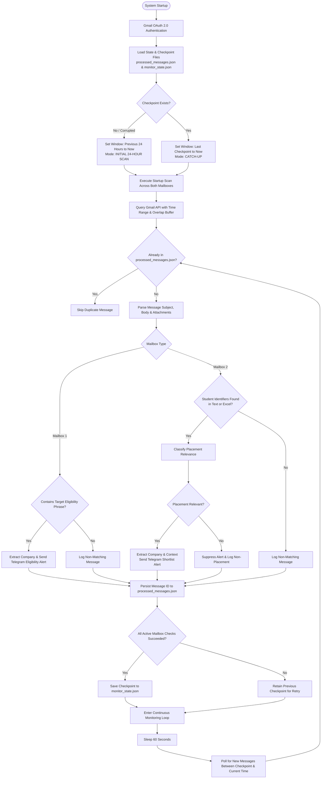
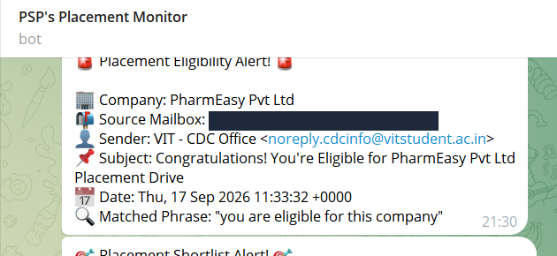
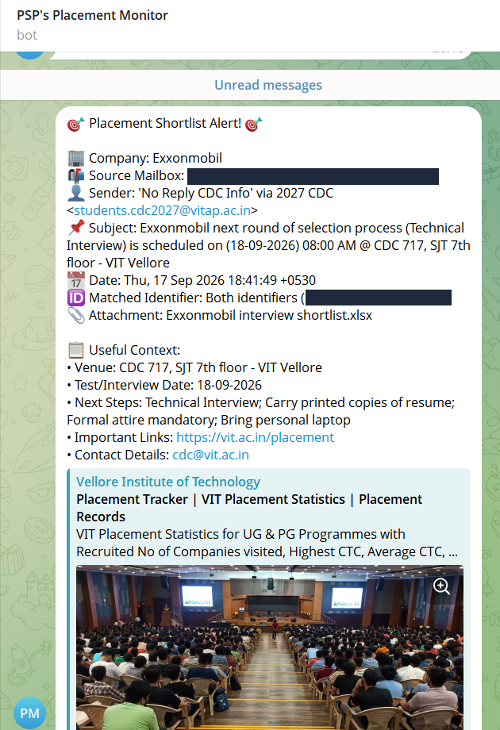
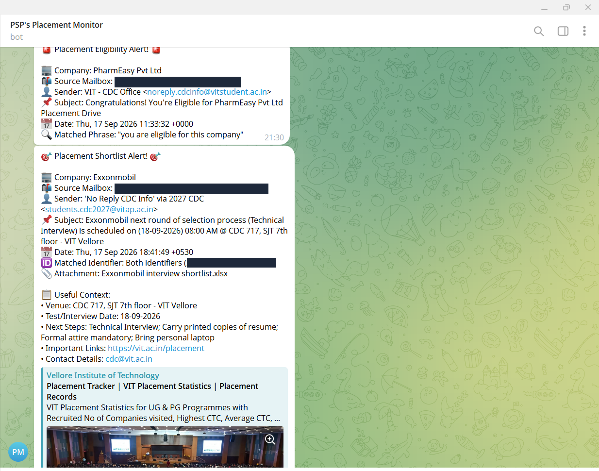

# Mail-Manager

**PlacementMonitor** is an automated, dual-mailbox Gmail monitoring engine designed to track time-critical placement eligibility notices, shortlist updates, and recruitment drive schedules. Powered by the official Google Gmail API and Telegram Bot API, the system continuously inspects incoming emails and attached spreadsheets, applies mailbox-specific matching and relevance classification to eliminate false positives, and delivers instant, structured push notifications directly to Telegram.

---

## Problem Statement & Solution

### Problem Statement

During campus and off-campus recruitment drives, students face a significant operational challenge: critical, time-sensitive placement notifications are scattered across multiple Gmail accounts, typically split between personal inboxes and official college/university mailboxes.

- **Embedded Shortlist Information:** Crucial candidate shortlist announcements are frequently enclosed within attached Excel workbooks (`.xlsx` or `.xls`) containing hundreds of candidate roll numbers, rather than stated directly in the email body.
- **High-Stakes Deadlines:** Placement updates often have narrow response windows for mandatory online test links, technical interview slots, confirmation forms, and venue reporting instructions. Missing an email or delaying action can result in immediate disqualification.
- **Error-Prone Manual Tracking:** Manually monitoring and refreshing multiple inboxes is exhausting and error-prone. More critically, when a student's computer is turned off or offline, any notifications arriving during that downtime are easily overlooked.

### Solution

**PlacementMonitor** automates the entire monitoring and notification pipeline to ensure no opportunity is missed:

- **Dual Gmail Monitoring:** Concurrently monitors both personal and college Gmail accounts using official Google Gmail APIs.
- **Startup Catch-Up Scanning:** Automatically performs an intelligent catch-up scan upon startup, retrieving and processing all emails delivered while the system was offline (from the last recorded monitoring checkpoint through the current time, or the past 24 hours on initial run).
- **Deep Email & Attachment Parsing:** Inspects email subjects and bodies while deeply scanning `.xlsx` and `.xls` spreadsheet attachments cell-by-cell across all sheets for candidate identifiers.
- **Two-Stage Deterministic Relevance Classification:** Evaluates candidate-matched emails through a two-stage classification engine to eliminate false positives from unrelated emails (such as Google security alerts, device sign-in warnings, billing receipts, or generic administrative circulars).
- **Structured Telegram Push Alerts:** Immediately dispatches clean, actionable notifications to Telegram, including vital operational context such as company name, test/interview dates, reporting times, venues, next steps, and coordinator links.

---

## Key Features

- **Dual Gmail Mailbox Monitoring:** Concurrently tracks a personal mailbox (`MAILBOX1`) for placement eligibility announcements and an official college mailbox (`MAILBOX2`) for student shortlist updates.
- **Official Gmail API Integration:** Connects using Google OAuth 2.0 with desktop client authorization and read-only access scope (`https://www.googleapis.com/auth/gmail.readonly`).
- **Smart Catch-Up Scanning:** Automatically recovers missed emails on startup—from the last recorded checkpoint up to current time (or the previous 24 hours on first run)—accommodating both brief restarts and multi-day offline periods.
- **Persistent Checkpoint & State Tracking:** Maintains atomic JSON state for processed message IDs (`data/processed_messages.json`) and the last successful scan timestamp (`data/monitor_state.json`).
- **60-Second Continuous Polling:** Enters a resilient, 60-second polling loop after catch-up, querying Gmail for newly arrived messages.
- **Duplicate Prevention:** Guaranteed single-notification delivery across application restarts and overlapping query buffers.
- **Deep Excel Attachment Processing:** Directly downloads, parses, and evaluates `.xlsx` (via `openpyxl`) and legacy `.xls` (via `xlrd`) attachments cell-by-cell across all sheets without requiring Microsoft Excel.
- **Placement Relevance Classification:** Multi-stage verification filters out false positives (such as Google security alerts, password resets, billing receipts, or generic university circulars) that happen to contain the student's registration number.
- **Intelligent Company & Context Extraction:** Automatically parses company names, interview dates, reporting times, venues, instructions, links, and contact addresses from subjects, message bodies, and attachment filenames.
- **Structured Telegram Alerts:** Dispatches clean, emoji-tagged notifications containing all essential operational context directly to mobile Telegram chats.
- **Structured Logging:** Generates timestamped Indian Standard Time (IST) log outputs detailing each cycle, email scan, classification decision, and state save.
- **Automated Testing:** Comprehensive unit test suite with 24 passing tests verifying catch-up windows, multi-day offline recovery, deduplication, error isolation, and classification logic.
- **Secure Secret Handling:** Keeps all credentials, tokens, and personal student identifiers strictly localized in `.env` and Git-ignored data directories.

---

## How It Works

The system lifecycle follows a structured sequence from initial authorization through catch-up processing to continuous 60-second polling:



### Complete Lifecycle Phases:

1. **Startup & Authentication:** The engine boots, reads configuration from `.env`, and initializes OAuth 2.0 services for Mailbox 1 and Mailbox 2. Expired tokens refresh automatically; new sessions initiate local browser consent.
2. **Load Persistent State:** The engine reads `data/monitor_state.json` (timestamp of last successful cycle) and `data/processed_messages.json` (lists of handled message IDs).
3. **Catch-Up Scan:**
   - On first run, it scans the preceding 24 hours up to startup time.
   - On restarts, it scans the period between the saved checkpoint and startup time, retrieving messages that arrived while the host was offline.
4. **Email & Attachment Processing:** Fetches candidate messages with pagination and an overlap buffer. Evaluates text and downloads `.xlsx` / `.xls` attachments into temporary storage for deep cell inspection.
5. **Relevance Classification & Alerts:** Confirms placement authenticity, extracts operational details, and dispatches structured alerts via the Telegram Bot API.
6. **State & Checkpoint Persistence:** Saves processed message IDs atomically to prevent duplicate notifications. Updates the checkpoint timestamp if both mailbox scans complete cleanly.
7. **Continuous Monitoring:** Enters continuous polling mode, sleeping 60 seconds (`CHECK_INTERVAL`) between iterations and repeating evaluation for newly arriving messages.

---

## System Architecture

PlacementMonitor is structured into modular components separating API access, polling control, text/spreadsheet inspection, classification logic, and alert dispatching:

```
┌─────────────────────────────────────────────────────────────┐
│                      Google Gmail API                       │
│     (Official v1 REST API — Read-Only Scope: gmail.readonly) │
└───────────────┬─────────────────────────────┬───────────────┘
                │                             │
                ▼                             ▼
┌──────────────────────────────┐ ┌──────────────────────────────┐
│  Mailbox 1 Client Session    │ │  Mailbox 2 Client Session    │
│ (OAuth Desktop Flow / Token) │ │ (OAuth Desktop Flow / Token) │
└───────────────┬──────────────┘ └──────────────┬───────────────┘
                │                             │
                └──────────────┬──────────────┘
                               │
                               ▼
┌─────────────────────────────────────────────────────────────┐
│                 Gmail Client (gmail_client.py)              │
│  - Multi-mailbox OAuth token management & refresh           │
│  - Pagination & time-range query builder (after: / before:) │
│  - MIME body decoders (Plain / HTML) & attachment downloader│
└──────────────────────────────┬──────────────────────────────┘
                               │
                               ▼
┌─────────────────────────────────────────────────────────────┐
│                 Monitor Engine (monitor.py)                 │
│  - Startup catch-up scan & continuous 60s polling loop      │
│  - Isolated per-mailbox try/except execution blocks         │
│  - Atomic checkpoint management (monitor_state.json)        │
│  - Atomic message deduplication (processed_messages.json)  │
└───────────────┬─────────────────────────────┬───────────────┘
                │                             │
                ▼                             ▼
┌──────────────────────────────┐ ┌──────────────────────────────┐
│ Eligibility Matcher          │ │ Shortlist & Excel Matcher    │
│ (matcher.py)                 │ │ (excel_matcher.py)           │
│                              │ │                              │
│ • Whitespace-normalized text │ │ • Multi-identifier scanner   │
│ • Phrase: "you are eligible  │ │   (REGISTRATION_NUMBER,      │
│   for this company"          │ │    NEOPAT_ID)                │
│ • Company extraction patterns│ │ • Deep cell parser:          │
│ • Format eligibility payload │ │   openpyxl (.xlsx)           │
│                              │ │   xlrd (.xls)                │
│                              │ │ • Two-stage relevance filter │
│                              │ │   (classify_placement_       │
│                              │ │    relevance)                │
│                              │ │ • Operational context parser │
└───────────────┬──────────────┘ └──────────────┬───────────────┘
                │                             │
                └──────────────┬──────────────┘
                               │
                               ▼
┌─────────────────────────────────────────────────────────────┐
│             Telegram Bot Dispatcher (telegram_bot.py)       │
│  - HTTPS POST delivery via Telegram Bot API (sendMessage)   │
│  - Formats clean Markdown/emoji alerts for mobile screens    │
└──────────────────────────────┬──────────────────────────────┘
                               │
                               ▼
┌─────────────────────────────────────────────────────────────┐
│                      User Telegram App                      │
│            (Real-Time Mobile Push Notifications)            │
└─────────────────────────────────────────────────────────────┘
```

---

## Mailbox Monitoring

PlacementMonitor assigns specific detection and processing responsibilities to each monitored Gmail account:

| Attribute | Mailbox 1 (`MAILBOX1`) | Mailbox 2 (`MAILBOX2`) |
| :--- | :--- | :--- |
| **Account Type** | Personal Gmail (`PERSONAL_GMAIL`) | Official College / University Gmail (`COLLEGE_GMAIL`) |
| **Monitored Scope** | Placement eligibility circulars | Campus recruitment shortlists, interview schedules, venues |
| **Target Fields** | Subject header, plain text, and HTML body | Subject header, body text, and attached `.xlsx` / `.xls` files |
| **Matching Logic** | Normalized match for phrase:<br>`"you are eligible for this company"` | Case-insensitive match for candidate identifiers:<br>`REGISTRATION_NUMBER` and `NEOPAT_ID` |
| **Classification** | Single-stage phrase match + regex company extraction | Two-stage verification: Identifier match followed by `classify_placement_relevance` |
| **Attachment Handling**| Not required for eligibility phrase matching | Downloads and deep-scans all sheets/rows in attached Excel files |
| **Alert Type** | `🚨 Placement Eligibility Alert! 🚨` | `🎯 Placement Shortlist Alert! 🎯` |

---

## Catch-Up + Continuous Monitoring

### How Catch-Up Works

A critical flaw with simple polling monitors is that emails received while the script is offline are lost if the monitor only checks for emails arriving *after* its startup time. PlacementMonitor resolves this through persistent checkpoint state:

1. **State Persistence:**
   - The engine stores the timestamp of the latest fully completed scan cycle in `data/monitor_state.json`.
   - Every processed email ID is stored in `data/processed_messages.json`.
2. **Startup Scan Window Calculation:**
   - **First Run (No Checkpoint):** Scans the previous 24 hours (`[now - 24h, now]`). Mode: `INITIAL 24-HOUR SCAN`.
   - **Restart Catch-Up:** Scans the window between `last_successful_checkpoint` and current startup time (`[checkpoint, now]`). Mode: `CATCH-UP`.
   - **Multi-Day Offline Support:** If the machine was powered off over a weekend (e.g., 66 hours), the catch-up window automatically covers the entire 66-hour interval.
3. **Safe Checkpoint Advancement:**
   - The checkpoint timestamp only advances if scans across all active mailboxes complete without unhandled errors.
   - If an API or network failure occurs on one mailbox, the previous checkpoint is retained, ensuring missed intervals are retried on the subsequent cycle.
4. **Boundary Safety & Deduplication:**
   - Queries use a 60-second overlap buffer to prevent emails at exact minute boundaries from being omitted.
   - Any message ID present in `processed_messages.json` is instantly bypassed, ensuring duplicate alerts are never sent.
5. **Transition to Continuous Polling:**
   - Once the startup catch-up scan finishes and updates the checkpoint, the engine switches to continuous monitoring, polling every 60 seconds (`CHECK_INTERVAL`).

### Practical Catch-Up Example:

```
Scenario: Weekend Shutdown & Monday Morning Resume

1. Friday 4:00 PM:
   - Monitor runs normally.
   - Last cycle succeeds; checkpoint saved at: 2026-09-18 16:00:00 IST.
   - Host workstation is shut down for the weekend.

2. During Offline Period (Saturday & Sunday):
   - Two placement shortlists arrive in Mailbox 2.
   - One eligibility notice arrives in Mailbox 1.

3. Monday 10:00 AM (Startup):
   - Monitor is launched.
   - Reads checkpoint: 2026-09-18 16:00:00 IST.
   - Calculates catch-up window: Friday 4:00 PM → Monday 10:00 AM (66 hours).
   - Mode: CATCH-UP.
   - Queries Gmail API across the 66-hour window.
   - Identifies and evaluates all 3 missed emails.
   - Dispatches corresponding Telegram alerts.
   - Checkpoint advances to Monday 10:00 AM.
   - Switches to 60-second continuous polling.
```

---

## Placement Relevance Classification

Candidate identifiers (such as college registration numbers or student IDs) appear in many communications beyond placement shortlists. For example, student emails often receive:
- Google Account Security Alerts and new device sign-in warnings
- Password reset and two-factor verification codes
- Fee payments, billing receipts, and subscription confirmations
- General university notices regarding hostels, transport, or library book returns

Without validation, any email containing the student's registration number would trigger a false-positive placement alert. PlacementMonitor solves this using a deterministic, rule-based **two-stage classification engine** (`classify_placement_relevance` in `src/excel_matcher.py`):

```
                       Email Received in Mailbox 2
                                    │
                                    ▼
                     Stage 1: Identifier Matching
            Does subject, body, or Excel attachment contain
                REGISTRATION_NUMBER or NEOPAT_ID?
                                    │
                    ┌───────────────┴───────────────┐
                    ▼                               ▼
                 [ No ]                          [ Yes ]
                    │                               │
             Ignore Message                         ▼
                                       Stage 2: Relevance Filter
                                    (classify_placement_relevance)
                                                    │
                 ┌──────────────────────────────────┴──────────────────────────────────┐
                 ▼                                                                     ▼
     Disqualifying Pattern Check                                          Positive Signal Discovery
 Does subject or sender match:                                        Does email or attachment contain:
 • Security alert / Critical security alert                          • Placement keywords (placement,
 • New sign-in / Google Account notice                                 shortlist, interview, eligible,
 • Password reset / Verification code                                  assessment, selection process)
 • Billing / Payment confirmation                                    • Verified sender (cdcinfo, students.cdc,
 • General notice without recruitment context                          placement cell, recruitment)
                 │                                                   • Match inside Excel shortlist attachment
                 ▼                                                                     │
          [ Match Found ]                                                              ▼
                 │                                                              [ Signal Found ]
                 ▼                                                                     │
        NON-PLACEMENT DECISION                                                 PLACEMENT DECISION
 • Suppress Telegram notification                                     • Extract company & context details
 • Log reason: Disqualified pattern                                   • Format & send Telegram alert
 • Save message ID to state file                                      • Save message ID to state file
   (Evaluated once, never repeated)
```

> [!NOTE]
> The classification engine is completely deterministic and explainable, utilizing compiled regex patterns, sender authority checks, and contextual keyword signals. It does not rely on opaque third-party AI APIs or heavyweight machine learning dependencies.

---

## Excel Attachment Processing

Campus placement cells commonly distribute candidate shortlists as attached spreadsheets. PlacementMonitor parses these workbooks directly:

- **Supported Formats:**
  - `.xlsx` (OpenXML): Parsed via `openpyxl` using `read_only=True` and `data_only=True` for high execution speed and low memory utilization.
  - `.xls` (BIFF8 Legacy): Parsed via `xlrd` by iterating through workbook sheets.
- **Deep Cell Scanning:** Every worksheet is traversed; every cell value is converted to a lowercase string and tested against `REGISTRATION_NUMBER` and `NEOPAT_ID`.
- **Ephemeral Sandbox:**
  1. The attachment is downloaded via `service.users().messages().attachments().get()` into `data/temp_attachments/`.
  2. The file is parsed and evaluated.
  3. The temporary attachment is unlinked and deleted in a `finally` block immediately after inspection, preventing disk accumulation.
- **Context Attachment:** When a match is found in an attachment, the workbook's filename (e.g., `Company_Shortlist_Round1.xlsx`) is displayed in the alert.

---

## Telegram Alerts

Alerts are formatted with clean emoji markers, structured field labels, and relevant context.

### Placement Shortlist Alert (Mailbox 2)

```text
🎯 Placement Shortlist Alert! 🎯

🏢 Company: <COMPANY>
📬 Source Mailbox: <COLLEGE_GMAIL>
👤 Sender: <SENDER>
📌 Subject: <SUBJECT>
📅 Date: <DATE>
🆔 Matched Identifier: <STUDENT_IDENTIFIER>
📎 Attachment: <ATTACHMENT_NAME>

📋 Useful Context:
• Venue: <INTERVIEW_VENUE>
• Test/Interview Date: <SCHEDULED_DATE>
• Reporting Time: <REPORTING_TIME>
• Next Steps: <NEXT_STEPS>
• Important Links: <APPLICATION_LINK>
• Contact Details: <COORDINATOR_EMAIL>
```

### Placement Eligibility Alert (Mailbox 1)

```text
🚨 Placement Eligibility Alert! 🚨

🏢 Company: <COMPANY>
📬 Source Mailbox: <PERSONAL_GMAIL>
👤 Sender: <SENDER>
📌 Subject: <SUBJECT>
📅 Date: <DATE>
🔍 Matched Phrase: "you are eligible for this company"
```

### Live Alert Screenshots

The repository includes verified notification screenshots demonstrating real mobile alert delivery:

| Eligibility Alert | Shortlist Alert | Notification Feed |
| :---: | :---: | :---: |
|  |  |  |

---

## Project Structure

```
Mail-Manager/
├── src/
│   ├── __init__.py                # Package initializer
│   ├── main.py                    # Application CLI entry point
│   ├── monitor.py                 # Core polling engine, catch-up logic & checkpoint manager
│   ├── gmail_client.py            # Gmail API OAuth client, token refresh & fetcher
│   ├── matcher.py                 # Mailbox 1 phrase & company extraction logic
│   ├── excel_matcher.py           # Mailbox 2 Excel attachment parser & relevance classifier
│   └── telegram_bot.py            # Telegram Bot API client & alert dispatcher
├── tests/
│   └── test_smart_monitor.py      # Comprehensive 24-test automated test suite
├── docs/
│   └── project-overview.md        # In-depth technical specification and architecture notes
├── screenshots/
│   ├── telegram-eligibility-alert.png
│   ├── telegram-shortlist-alert.png
│   └── telegram-bot-overview.png
├── data/                          # Local runtime data & tokens (Git-ignored)
│   ├── token_mailbox1.json        # OAuth token cache for Mailbox 1
│   ├── token_mailbox2.json        # OAuth token cache for Mailbox 2
│   ├── monitor_state.json         # Checkpoint timestamp storage
│   ├── processed_messages.json    # Deduplication message ID cache
│   └── temp_attachments/         # Ephemeral attachment inspection folder
├── .env.example                   # Environment configuration template (no secrets)
├── .gitignore                     # Exclusion rules for credentials, tokens, and data
├── requirements.txt               # Pinned Python package dependencies
├── start_monitor.ps1              # Turnkey Windows PowerShell launcher
└── README.md                      # Project documentation
```

---

## Requirements

The project relies on a focused set of standard libraries and production-tested Python packages listed in `requirements.txt`:

| Package | Purpose |
| :--- | :--- |
| `google-api-python-client` | Official Google API client library for Gmail API interaction |
| `google-auth-httplib2` | HTTP transport adapter for Google authentication |
| `google-auth-oauthlib` | OAuth 2.0 client flow library for desktop user consent |
| `openpyxl` | Reader and parser for `.xlsx` spreadsheets (read-only mode) |
| `xlrd` | Reader and parser for legacy `.xls` spreadsheets |
| `requests` | HTTP client for dispatching Telegram Bot API requests |
| `python-dotenv` | Environment variable loader from root `.env` file |
| `beautifulsoup4` | HTML parser for stripping and normalizing email markup |
| `tzdata` | Cross-platform IANA time zone database support |

---

## Setup

Follow these steps to set up and run PlacementMonitor on Windows:

### Step 1: Clone the Repository

```powershell
git clone https://github.com/psprashanth25/Mail-Manager.git
cd Mail-Manager
```

### Step 2: Create and Activate Virtual Environment

```powershell
python -m venv .venv
.\.venv\Scripts\Activate.ps1
```

*(If PowerShell script execution is restricted, run `Set-ExecutionPolicy -Scope Process -ExecutionPolicy Bypass` before activating).*

### Step 3: Install Dependencies

```powershell
pip install -r requirements.txt
```

### Step 4: Configure Environment Variables

Copy the template file `.env.example` to `.env`:

```powershell
Copy-Item .env.example .env
```

Open `.env` and fill in your private settings:
- Monitored Gmail addresses (`MAILBOX1`, `MAILBOX2`)
- Candidate identifiers (`REGISTRATION_NUMBER`, `NEOPAT_ID`)
- Telegram bot credentials (`TELEGRAM_BOT_TOKEN`, `TELEGRAM_CHAT_ID`)

### Step 5: Configure Google Cloud Gmail API Credentials

1. Open the [Google Cloud Console](https://console.cloud.google.com/).
2. Create a new project (e.g., `PlacementMonitor`).
3. Navigate to **APIs & Services > Library** and enable the **Gmail API**.
4. Configure the **OAuth consent screen**:
   - User Type: **External**.
   - Add your monitored Gmail addresses under **Test Users**.
5. Navigate to **APIs & Services > Credentials**:
   - Click **Create Credentials > OAuth client ID**.
   - Application type: **Desktop app**.
   - Name: `PlacementMonitor Desktop`.
6. Download the generated client secrets JSON file, rename it to `credentials.json`, and place it in the project root directory.

### Step 6: Configure Telegram Bot Credentials

1. Open Telegram and message [@BotFather](https://t.me/BotFather).
2. Send `/newbot` and follow the prompts to create your bot.
3. Copy the HTTP API token into `TELEGRAM_BOT_TOKEN` in `.env`.
4. Start a chat with your bot by clicking `/start`.
5. Retrieve your numeric Chat ID from [@userinfobot](https://t.me/userinfobot) or [@raw_data_bot](https://t.me/raw_data_bot) and set it as `TELEGRAM_CHAT_ID` in `.env`.

### Step 7: Authenticate Mailboxes (First Run Only)

Run the authentication utility for each mailbox to complete the one-time browser OAuth consent flow:

```powershell
# Authenticate Mailbox 1 (Personal Gmail)
python src/gmail_client.py 1

# Authenticate Mailbox 2 (College Gmail)
python src/gmail_client.py 2
```

This generates `data/token_mailbox1.json` and `data/token_mailbox2.json`. Subsequent runs will refresh tokens automatically without user intervention.

---

## Configuration

All configuration is managed via `.env` in the project root:

| Variable | Description | Example / Default |
| :--- | :--- | :--- |
| `TELEGRAM_BOT_TOKEN` | HTTP API Bot Token obtained from [@BotFather](https://t.me/BotFather) | `123456789:ABCdefGhIJKlmNoPQRsTUVwxyZ` |
| `TELEGRAM_CHAT_ID` | Numeric Telegram user or channel Chat ID | `987654321` |
| `MAILBOX1` | Email address of personal mailbox monitored for eligibility | `student.personal@gmail.com` |
| `MAILBOX2` | Email address of college mailbox monitored for shortlists | `student.placement@university.edu` |
| `REGISTRATION_NUMBER`| Candidate's university registration or roll number | `22ABC1234` |
| `NEOPAT_ID` | Candidate's assessment portal or student ID | `987654` |
| `CHECK_INTERVAL` | Continuous monitoring polling interval in seconds | `60` |

---

## Running the Application

### Option 1: PowerShell Launcher (Recommended on Windows)

A turnkey launcher script is included that automatically verifies the virtual environment and starts the engine:

```powershell
.\start_monitor.ps1
```

### Option 2: Python Command Line

Activate the virtual environment and invoke the main entry point:

```powershell
python src/main.py
```

### CLI Diagnostic & Utility Flags

The engine provides built-in command-line arguments for troubleshooting and diagnostics:

```powershell
# Display current checkpoint timestamp, interval, and processed email counts
python src/monitor.py --status

# Execute a fixed number of polling cycles (ideal for automated checks)
python src/monitor.py --cycles 3

# Override polling interval for the current session (e.g., 30 seconds)
python src/monitor.py --interval 30

# Diagnostic recheck of recent Mailbox 1 emails against the eligibility phrase (dry-run)
python src/monitor.py --recheck-mailbox1

# Diagnostic scan of recent Mailbox 2 emails and Excel attachments (dry-run)
python src/monitor.py --recheck-mailbox2

# Send live Telegram alerts during diagnostic scan if a match is found
python src/monitor.py --recheck-mailbox2 --send-alert

# Reset state files
python src/monitor.py --reset-checkpoint    # Reset checkpoint (forces 24-hour scan on next run)
python src/monitor.py --reset-state         # Clear processed message history
python src/monitor.py --reset-all           # Reset both checkpoint and message history
```

---

## Testing

The project includes an automated test suite implemented using Python's standard `unittest` framework with full isolation and mocking:

```powershell
.\.venv\Scripts\python.exe -m unittest discover -s tests -p "test_*.py" -v
```

### Verified Test Suite Status:

**24 / 24 tests passed** (100% pass rate).

### Key Test Categories Covered:
- **Scan Window Logic:** Initial 24-hour fallback, restart catch-up windows, and multi-day offline gap calculation (e.g., 66-hour weekend window).
- **Time Boundary Verification:** Ensuring emails received within the window are included while emails outside the boundary are excluded.
- **Offline Email Recovery:** Detecting emails delivered while the application was offline upon restart.
- **Deduplication:** Overlapping query safety buffers ensuring duplicate notifications are never dispatched.
- **Error Isolation:** Ensuring API failures on Mailbox 1 do not halt Mailbox 2, and verifying checkpoints do not advance on incomplete scans.
- **Checkpoint Resilience:** Corrupted checkpoint JSON safely falls back to a clean 24-hour scan while preserving a backup file.
- **Placement Relevance Classification:** Validating true positives (selection rounds, placement drives, attached Excel shortlists) and rejecting false positives (Google security alerts, sign-in alerts, university circulars).

---

## Security & Privacy

Security and data protection are core design requirements:

- **Zero Tracked Secrets:** `.env`, `credentials.json`, and OAuth tokens (`data/token_mailbox*.json`) are explicitly excluded from Git tracking in `.gitignore`.
- **Read-Only Scope:** Google OAuth authorization strictly requests the `https://www.googleapis.com/auth/gmail.readonly` scope. The monitor cannot delete messages, modify drafts, send emails, or alter labels.
- **Local Data Processing:** All email body parsing and Excel attachment scanning take place strictly in memory or temporary local storage on your machine. No email contents or student identifiers are transmitted to third-party servers.
- **Ephemeral Attachment Cleanup:** Attachments downloaded for inspection are immediately deleted upon parsing.
- **Sanitized Logging:** Console logs and Telegram notifications mask private authentication tokens.
- **Pre-Commit Verification:** Always run `git status` before pushing changes to verify that credentials or personal data have not been staged.

---

## Limitations / Notes

- **Host Machine Dependency:** The monitor executes locally on your workstation. If your computer is powered off or disconnected from the internet, polling pauses (missed emails are caught up automatically when restarted).
- **Desktop OAuth Consent:** Initial authentication requires a desktop browser for user consent.
- **Encrypted Files:** Password-protected or encrypted Excel attachments cannot be inspected without decryption credentials.
- **Gmail API Quotas:** Standard Gmail API per-minute quota limits apply; default 60-second polling operates well within standard API usage thresholds.

---

## Future Improvements

- **Containerization:** Package the application with Docker and container secrets support.
- **24/7 Cloud Worker:** Deploy as an always-on background worker on an Oracle Cloud Always Free or GCP e2-micro virtual machine.
- **Push Notification Architecture:** Implement Google Cloud Pub/Sub webhooks for real-time push event notification instead of polling.
- **PDF Shortlist Parsing:** Add support for parsing student roll numbers within attached PDF circulars.

---

## Author

**P. S. Prashanth**
- GitHub: [@psprashanth25](https://github.com/psprashanth25)
- Repository: [Mail-Manager](https://github.com/psprashanth25/Mail-Manager)
