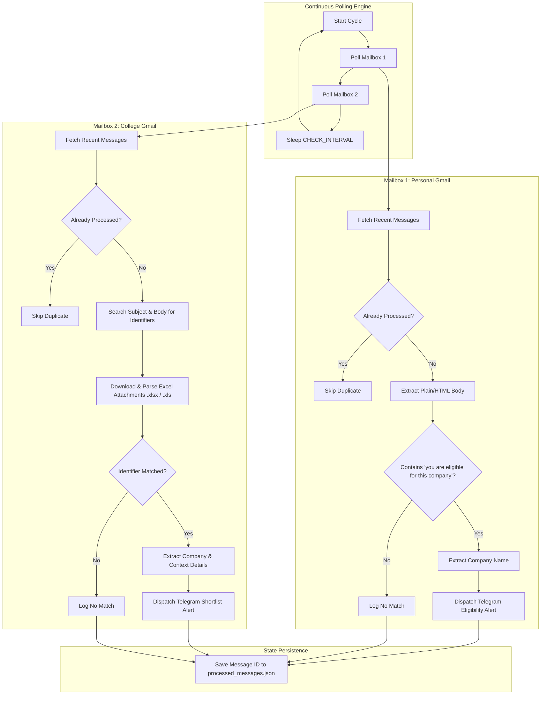

# PlacementMonitor: Project Technical Overview

## 1. Project Objective

During campus and off-campus recruitment drives, students receive critical communications across multiple email accounts, including personal Gmail inboxes and official college/university mailboxes. These emails often contain time-sensitive placement eligibility alerts, shortlist announcements, exam schedules, and interview details. Crucial shortlist information is frequently embedded in attached spreadsheets (`.xlsx` or `.xls`) rather than the email body text.

Missing or delaying response to these emails can result in disqualified candidacy. **PlacementMonitor** automates the continuous monitoring of two distinct Gmail accounts using the official Google Gmail API, analyzes email contents and spreadsheet attachments for targeted student eligibility criteria, and immediately dispatches structured, actionable alerts directly to a designated Telegram chat.

---

## 2. System Architecture & Functional Flow

The system runs a continuous polling loop that alternates between Mailbox 1 and Mailbox 2, processing new unread or recent messages, evaluating them against mailbox-specific matching engines, and notifying the user via Telegram when a match is found.



---

## 3. Mailbox 1 Logic: Eligibility Detection

* **Target Account:** Personal Gmail (configured via `MAILBOX1` in `.env`).
* **Evaluation Target:** Email subject and extracted plain text or HTML body.
* **Matching Rule:** Case-insensitive search for the phrase:
  ```text
  "you are eligible for this company"
  ```
* **Whitespace Normalization:** Uses regular expressions (`\s+` replacement) so that matching functions reliably regardless of newlines, tabs, or erratic spacing within HTML emails.
* **Company Name Extraction:**
  When a match is identified, `matcher.extract_company_name()` executes sequential regex patterns:
  1. `eligible for this company:\s*<Company Name>`
  2. `Congratulations! You're Eligible for\s*<Company Name>`
  3. `Eligible for\s*<Company Name>`
  4. `Company:\s*<Company Name>`
  If no company pattern matches cleanly, it safely falls back to `"Company name could not be determined"`.

---

## 4. Mailbox 2 Logic: Shortlist & Identifier Matching

* **Target Account:** Official College/University Gmail (configured via `MAILBOX2` in `.env`).
* **Evaluation Target:** Email subject, body, and all attached Excel workbooks.
* **Target Identifiers:**
  - Student Registration / Roll Number (configured via `REGISTRATION_NUMBER` in `.env`)
  - Assessment Portal / NeoPat ID (configured via `NEOPAT_ID` in `.env`)
* **Inspection Layers:**
  1. **Subject Line**: Case-insensitive substring match.
  2. **Message Body**: HTML parsed via BeautifulSoup and searched case-insensitively.
  3. **Spreadsheet Attachments**: Every workbook attached to the email is downloaded temporarily and deep-scanned.

---

## 5. Excel Attachment Processing Logic

When an email in Mailbox 2 contains attachments ending in `.xlsx` or `.xls`:

1. **Attachment Retrieval:** The binary file payload is downloaded into a local temporary folder (`data/temp_attachments/`) via `users.messages.attachments.get()`.
2. **Format-Aware Parsing:**
   - **`.xlsx` files:** Parsed using `openpyxl` in `read_only=True` and `data_only=True` mode for fast memory-efficient iteration across all worksheets, rows, and individual cells.
   - **`.xls` files:** Parsed using `xlrd`, iterating through all sheet indices, rows, and columns.
3. **Comprehensive Search:** Every cell value is converted to a lowercase string and evaluated against both the Registration Number and NeoPat ID.
4. **Immediate Cleanup:** The downloaded temporary attachment is unlinked and deleted in a `finally` block immediately after parsing to prevent disk accumulation.
5. **Contextual Metadata:** If an attachment contains a match, the filename (e.g., `Exxonmobil interview shortlist.xlsx`) is recorded and included in the Telegram alert.

---

## 6. Placement Context & Company Extraction

For Mailbox 2 emails, the system extracts rich operational context so the student does not have to open their laptop just to check vital details:

* **Company Identification:** Scans subject patterns (e.g., `<Company> next round of selection process`, `<Company> shortlist`), body text, and attachment filenames.
* **Venue:** Matches patterns like `Venue: CDC 717, SJT 7th floor` or `@ venue`.
* **Test / Interview Date:** Matches date patterns formatted as `DD-MM-YYYY` or `DD/MM/YYYY`.
* **Reporting Time:** Matches formats like `08:00 AM`, `2:30 PM`.
* **Application Deadline:** Identifies deadline phrases and cutoff dates.
* **Next Steps & Instructions:** Detects keywords for technical interview, online assessment, mandatory formal attire, laptop requirements, and resume copies.
* **Important Links:** Captures application and portal URLs.
* **Contact Details:** Extracts placement coordinator and support email addresses.

---

## 7. Telegram Notification Flow

Alerts are formatted as readable Markdown/plain-text messages and delivered through the Telegram Bot API (`sendMessage` endpoint) via HTTP POST:

### Eligibility Alert Format (Mailbox 1)
```text
🚨 Placement Eligibility Alert! 🚨

🏢 Company: <Company Name>
📬 Source Mailbox: <Email Address>
👤 Sender: <Sender Details>
📌 Subject: <Email Subject>
📅 Date: <Timestamp>
🔍 Matched Phrase: "you are eligible for this company"
```

### Shortlist Alert Format (Mailbox 2)
```text
🎯 Placement Shortlist Alert! 🎯

🏢 Company: <Company Name>
📬 Source Mailbox: <Email Address>
👤 Sender: <Sender Details>
📌 Subject: <Email Subject>
📅 Date: <Timestamp>
🆔 Matched Identifier: <Both identifiers (reg_no, neopat_id) / reg_no / neopat_id>
📎 Attachment: <Workbook Filename>

📋 Useful Context:
• Venue: <Extracted Venue>
• Test/Interview Date: <Date>
• Reporting Time: <Time>
• Next Steps: <Extracted Next Steps>
• Important Links: <Extracted Links>
• Contact Details: <Extracted Contact Info>
```

---

## 8. Duplicate Prevention & State Management

To avoid spamming notifications on subsequent polling iterations:

* **State File:** `data/processed_messages.json` stores lists of processed Gmail message IDs per mailbox:
  ```json
  {
    "mailbox1": ["191f63a4b64e5480", "191f635678ab4021"],
    "mailbox2": ["191f7a0be9cd9234", "191f79f18a2456aa"]
  }
  ```
* **Atomic Writes:** State updates are saved using an atomic file replacement (`temp_file.replace(state_file)`) to eliminate file corruption during abrupt shutdowns.
* **Skipped Duplicates:** Any message ID already present in the state cache is immediately bypassed without re-downloading or re-parsing.

---

## 9. Error Handling & Fault Isolation

* **Isolated Mailbox Checks:** Each mailbox execution is wrapped in separate `try-except` blocks. If Mailbox 1 suffers an API glitch, Mailbox 2 continues running normally without interruption.
* **Graceful Token Refresh:** If an OAuth token expires during continuous polling, the system catches the expiration and automatically calls `creds.refresh(Request())` before falling back.
* **Malformed Email Resilience:** Corrupted MIME structures, non-standard HTML, or password-protected attachments are caught with descriptive warnings without crashing the continuous monitoring loop.
* **Clean Interruption:** Keyboard interrupt (`Ctrl+C`) cleanly breaks the polling loop and reports a safe termination state.

---

## 10. Current Limitations

1. **Local Host Execution:** The monitor runs locally on a workstation and requires the host computer to remain active and connected to the internet.
2. **Interactive Initial OAuth:** Initial Gmail authentication requires a browser window for user consent (desktop OAuth flow).
3. **Excel File Formats:** While `.xlsx` (OpenXML) and legacy `.xls` (BIFF8) workbooks are supported, password-protected sheets or encrypted files cannot be searched without user-provided decryption keys.

---

## 11. Future Cloud Deployment (Planned Future Work)

> [!NOTE]
> Cloud hosting is **future work** and is **not** currently implemented. The existing system is designed and validated for local execution.

Planned roadmap items for future iterations include:
* **Headless OAuth & Service Token Flow:** Migrating token storage to secret management services (e.g., AWS Secrets Manager, GCP Secret Manager, or OCI Vault) for zero-interaction containerized deployments.
* **Docker Containerization:** Packaging the application with a lightweight Python Alpine base image and a non-root user.
* **Cloud Hosting:** Deploying as a 24/7 background worker on a free-tier virtual machine (e.g., Oracle Cloud Always Free compute instance or GCP e2-micro instance) or container runner.
* **Webhook Architecture:** Exploring Gmail Push Notifications (Cloud Pub/Sub) as an event-driven alternative to periodic polling.
